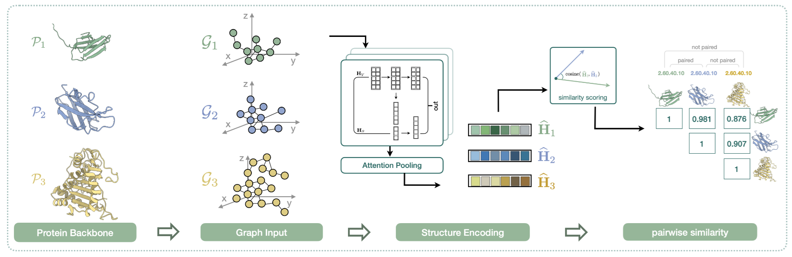
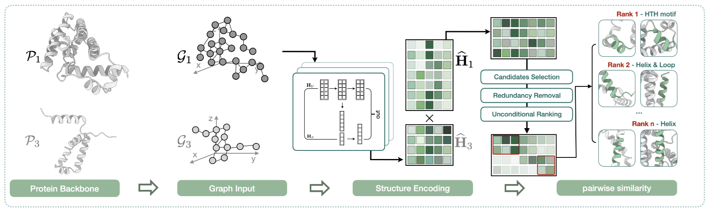
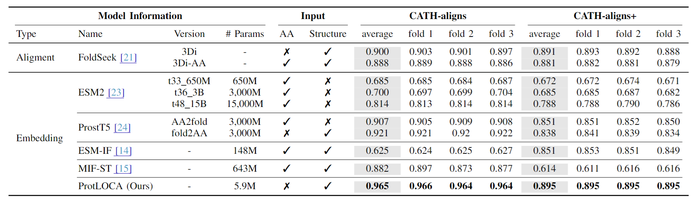

# Protein Representation Learning with Sequence Information Embedding: Does it Always Lead to a Better Performance?

## 🚀 Introduction (Venus-ProtLOCA/ ProtLOCA)

Using structure information only for protein homology detection.





## 📑 Results

### News

- [2024.08.22] Congratulations! Our paper was accepted at *IEEE International Conference on Bioinformatics and Biomedicine 2024 (IEEE BIBM 2024)*!

### Paper Results



## 🛫 Requirement

Please make sure you have installed Anaconda3 or Miniconda3.

```shell
conda env create -f environment.yaml
conda activate protloca
```

## 🧬 Start with ProtLOCA

### Train from scratch

Script example can be found at `script/`.


## 🙌 Citation

Please cite our work if you have used our code or data. We are pleased to see improvements in the subsequent work.

```
@inproceedings{tan2024protloca,
  title={Protein representation learning with sequence information embedding: Does it always lead to a better performance?},
  author={Tan, Yang and Zheng, Lirong and Zhong, Bozitao and Hong, Liang and Zhou, Bingxin},
  booktitle={2024 IEEE International Conference on Bioinformatics and Biomedicine (BIBM)},
  pages={233--239},
  year={2024},
  organization={IEEE}
}
```

## 📝 License

This project is licensed under the terms of the [CC-BY-NC-ND-4.0](https://creativecommons.org/licenses/by-nc-nd/4.0/legalcode) license.