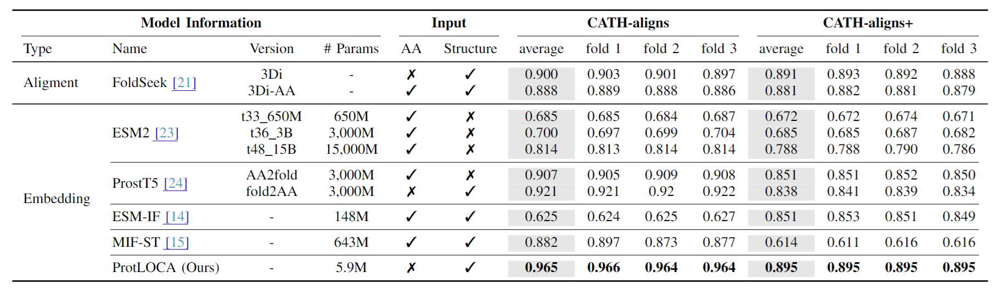

# Protein Representation Learning with Sequence Information Embedding: Does it Always Lead to a Better Performance?

## 🚀 Introduction (ProtLOCA)

Using structure information only for protein homology detection.


## 📑 Results

### News

- [2024.08.22] Congratulations! Our paper was accepted as a short paper at *IEEE International Conference on Bioinformatics and Biomedicine 2024 (IEEE BIBM 2024)*!

### Paper Results



## 🛫 Requirement

Please make sure you have installed Anaconda3 or Miniconda3.

```shell
conda env create -f environment.yaml
conda activate protloca
```

## 🧬 Start with ProtLOCA

### Train from scratch

Script example can be found at `script/`.
